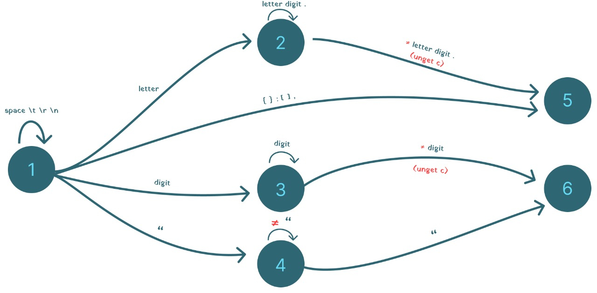

# mini-qml
This project was made for Programming Language Subject at college.

# Objective
In this project, we should make a program to identify if a file in QML is well formed or not.

# Developing
## Step 1:
Making a lexical automata to the lexemes of the language:


## Step 2:
Describing a grammar in EBNF to make the parsing of the Programming Language.

```
<code> ::= {<object>}
<object> ::= <name> ’{’ <object> | <name-value> ’}’
<name-value> ::= <name> ’:’ <value>
<value> ::= <number> | <text> | <name> | <list>
<list> ::= ’[’ [ <list-element> { ’,’ <list-element> } ] ’]’
<list-element> ::= <number> | <name> | <object> | <text>
```

# Running the project
To run the project, use the following command:
java mdi examples/teste.qml

